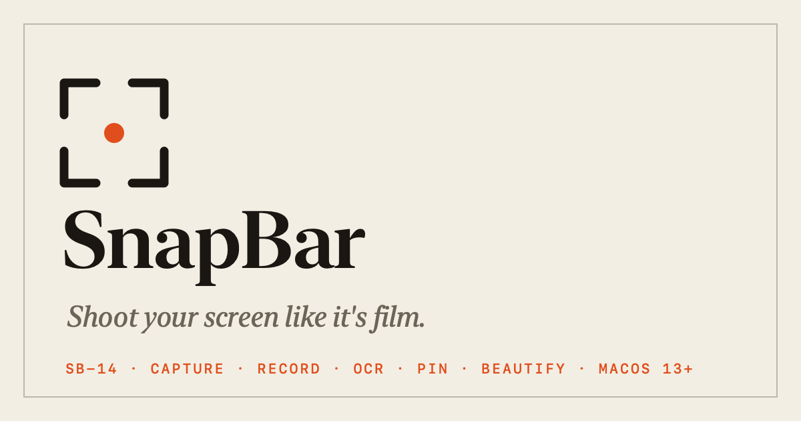

<p align="center">
  
</p>

# SnapBar

SnapBar is a macOS menu bar app for screenshots and screen recordings. It's about
4,000 lines of Swift across 23 files, has no third-party dependencies, and the
release build is under 3 MB.

[Website](https://ivanegerev.github.io/snapbar/) ·
[Download the latest release](https://github.com/ivanegerev/snapbar/releases/latest)

Runs on macOS 13 Ventura or later, Apple Silicon and Intel. The build is ad-hoc
signed and not notarized yet, so on first launch right-click SnapBar.app and
choose Open.

## Features

Free:

- Area, window and full-screen capture with the native crosshair, optional window
  shadow and cursor, a self-timer, and one file per display on multi-monitor setups
- Recording of a selected area or the whole screen, with optional microphone audio
  and click highlighting. The menu bar icon turns into a red timer while recording.
- A clip trimmer that opens when a recording stops
- An annotation editor with arrows, boxes, ellipses, highlighter, freehand, text,
  auto-numbered steps, redact, crop, zoom and undo
- A floating thumbnail after every capture. Click it to edit, hover for quick
  actions, or drag it straight into Slack, Mail or Figma.
- A searchable history of every capture
- A screen color picker that copies the hex value
- Annotating an image straight from the clipboard
- Auto-tidy for captures older than 7, 30 or 90 days, a toggle that hides desktop
  icons for clean recordings, PNG/JPEG/HEIC/PDF/TIFF output, and launch at login

Pro, with a 7-day trial of everything on first launch:

- Copy text from any region of the screen, using on-device OCR through Vision
- Scan a QR code on screen
- Pin a screenshot so it floats above every window
- Beautify a shot with a background, padding, rounded corners and a shadow
- Pixelate sensitive details in the editor
- Export recordings as GIFs from the trimmer

Pro is $19.99 once or $2.99 a month. Both unlock the same features.

## Hotkeys

All use Control+Shift, so they sit next to the system's ⇧⌘3/4/5 without clashing.

| Hotkey | Action |
|--------|--------|
| ⌃⇧3 | Capture full screen |
| ⌃⇧4 | Capture area |
| ⌃⇧6 | Capture window |
| ⌃⇧5 | Start or stop an area recording |
| ⌃⇧2 | Copy text from screen (Pro) |
| ⌃⇧P | Pin the last screenshot (Pro) |
| ⌃⇧E | Annotate the last screenshot |
| ⌃⇧H | Open capture history |
| ⌃⇧C | Pick a color from the screen |

## How it works

The capture itself is handed to `/usr/sbin/screencapture`, the same tool behind
⇧⌘5. That gives SnapBar Apple's own selection UI, correct Retina and HDR handling,
and the system recording pipeline without reimplementing any of it on
ScreenCaptureKit. The app owns everything around the capture: file naming and
storage, the clipboard, thumbnails, history, editing and hotkeys.

A few other decisions:

- Global hotkeys go through the Carbon hotkey API, so SnapBar never asks for
  Accessibility permission. It needs Screen Recording, plus Microphone only if
  mic audio is turned on.
- AppKit runs the menu bar item as an agent app with no Dock icon. The popover,
  editor, history and settings windows are SwiftUI.
- Licensing works offline. `LicenseManager.swift` validates the key format
  locally and the app never phones home about it.
- The only network request the app makes is a daily check of the GitHub releases
  API for a newer version, and Settings can turn it off.

## Store

The website sells Pro through Stripe Payment Links. After checkout, Stripe sends
the buyer to `docs/thanks.html`, which gets a key from a Cloudflare Worker
(`store/worker.js`). The worker asks Stripe whether the session was actually paid
and derives the key as an HMAC of the session ID, so there's no database to run.

Checkout isn't switched on yet. Until it is, the buy page offers the trial and a
key by email. Setup steps and current status are in
[store/README.md](store/README.md).

## Building

Needs Xcode or the Command Line Tools on macOS 13 or later.

```sh
scripts/build-app.sh    # release build, bundled and signed into dist/SnapBar.app
open dist/SnapBar.app
```

For quick iteration, `swift build && .build/debug/SnapBar` works, though launch at
login only works from the real app bundle.

## Layout

| Path | What's there |
|------|--------------|
| `Sources/SnapBar/` | The app |
| `docs/` | The website, served by GitHub Pages: landing page, buy page, key delivery page |
| `store/` | The license worker and payment setup notes |
| `scripts/` | App bundle build script and generators for the icon and social preview image |
| `Resources/` | `Info.plist` and the app icon |

Inside `Sources/SnapBar/`:

| File | Responsibility |
|------|----------------|
| `main.swift`, `AppDelegate.swift` | Startup and global hotkey bindings |
| `AppServices.swift` | Shared state for the SwiftUI views and every user-facing action |
| `StatusItemController.swift` | Menu bar icon, popover and recording timer |
| `MenuPopoverView.swift` | The menu bar dropdown |
| `CaptureManager.swift` | Drives `screencapture` for stills and recordings |
| `AnnotationEditor.swift` | Markup editor: tools, canvas, beautify and final render |
| `ClipEditor.swift` | Recording trimmer and GIF export |
| `HistoryWindow.swift` | Searchable capture history grid |
| `ThumbnailPanel.swift` | Floating post-capture preview with drag-out |
| `PinWindow.swift` | Screenshots pinned above other windows |
| `OCRManager.swift` | Copy text from screen via Vision |
| `QRManager.swift` | QR and barcode scanning via Vision |
| `HotkeyManager.swift` | Carbon global hotkeys |
| `PermissionsManager.swift` | Screen Recording permission flow |
| `LicenseManager.swift` | Trial and offline license validation |
| `UpgradeWindow.swift` | Pricing and key activation window |
| `WelcomeWindow.swift` | First-run shortcut tour |
| `SettingsWindow.swift` | Settings and launch at login (`SMAppService`) |
| `AboutWindow.swift` | About panel |
| `Prefs.swift` | `UserDefaults`-backed preferences and recent captures |
| `Toast.swift` | HUD notifications |
| `Brand.swift` | Color palette shared by the views |

## Design

The visual identity, called Contact Sheet, borrows from the printed sheets film
photographers mark up with a grease pencil. It's written up in
[BRAND.md](BRAND.md), and `scripts/make-icon.swift` generates the app icon from
the same mark.
